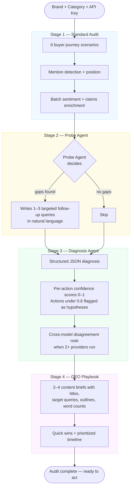

# Brand LLM Visibility Audit

When someone asks ChatGPT "what's the best CRM?" — which brands show up, and how are they described? Most companies have no idea. This tool answers that question in under 2 minutes, across multiple AI models, with a confidence-scored action plan to fix what's broken.

---

## The problem

AI models are becoming the first stop for purchase decisions. Unlike Google, there is no established playbook for LLM visibility: no keyword rankings, no backlink audits. Brands are flying blind.

This tool gives product and marketing teams a structured read on where they stand, where they are invisible, and what to do about it.

---

## What you get

Runs 6 buyer-journey scenarios across one or more AI models, then produces:

| Output | What it tells you |
|---|---|
| Visibility score | Percentage of scenarios where your brand was mentioned |
| List position | Where in the response your brand appeared (1st, 2nd, etc.) |
| Sentiment and claims | How the model frames your brand, not just whether it mentions you |
| Probe results | Follow-up queries chosen by an agent based on what it found |
| Action plan | 2 to 3 prioritized actions with confidence scores and effort/impact ratings |
| Competitor share of voice | Competitor mentions across all responses, no extra API calls |
| Cross-model comparison | Why Gemini mentions you but ChatGPT does not |

**The 6 standard scenarios:** market discovery, tool recommendation, brand knowledge, competitive landscape, best-in-class search, vendor comparison. These map to real buyer-journey stages.

---

## How the analysis works

Most LLM audit tools run fixed prompts and count mentions. This one runs a four-stage agentic pipeline where each stage feeds the next.



**Stage 1: Standard audit.** Six fixed scenarios mapped to buyer-journey stages, regex mention detection, and a single batch LLM call for sentiment and claims across all results.

**Stage 2: Probe agent.** An LLM orchestrator reviews the six results and decides whether to fire 1 to 3 follow-up queries. It reasons about what it found — invisible brand, negative framing, mixed signals — and writes queries in natural language. Not templated.

**Stage 3: Diagnosis agent.** Produces a structured diagnosis with per-action confidence scores. Actions under 0.6 are flagged as hypotheses. Multi-model runs include a cross-model note naming specific models and hypothesizing why they differ.

**Stage 4: GEO Playbook.** Translates the diagnosis into a ready-to-execute content plan: 2 to 4 briefs with titles, target queries, outlines, word counts, and a prioritized timeline. Built for the team that actually has to fix the problem.

---

## Architecture

```
app.py                  Streamlit orchestrator: UI state, audit loop, tab routing
core/
  config.py             Provider registry, scenario definitions, preset brands
  models.py             Pydantic types: ScenarioResult, ModelAudit, AuditDiagnosis, GEOPlaybook
llm/
  client.py             Unified call_llm() and call_json() for all providers
agents/
  analyzer.py           Regex mention detection, batch claim/sentiment enrichment
  probe_agent.py        Agentic probe loop (LLM-driven follow-up decision)
  diagnosis_agent.py    Structured GEO diagnosis (single and multi-model paths)
  playbook_agent.py     GEO content playbook generator
ui/
  styles.py             Full CSS design system (light B2B theme)
  components.py         Reusable st.markdown() render functions
tests/                  219 unit tests, all mocked, no API calls required
```

**Design principles:**
- `call_llm()` is the only place that touches provider SDKs. Swap providers in one file.
- Agent outputs are Pydantic models. No raw dicts crossing module boundaries.
- `enrich_with_claims()` is one batch call per model run, not one call per scenario.
- UI components are pure render functions. No business logic in the display layer.

---

## Providers

| Provider | Free tier | Models |
|---|---|---|
| Groq | Yes (high limits) | Llama 3.3 70B, Llama 3.1 8B, Mixtral 8x7B |
| Gemini | Yes | Gemini 2.5 Flash, 1.5 Flash |
| OpenAI | No | GPT-4o Mini, GPT-4o |
| Perplexity | No | Sonar, Sonar Pro |
| Anthropic | No | Claude Haiku, Claude Sonnet |

Only a Groq or Gemini key is needed to run a full audit. Additional keys unlock multi-model comparison and cross-model diagnosis.

---

## Running locally

```bash
git clone <repo-url>
cd brand-llm-visibility-audit
pip install -r requirements.txt
streamlit run app.py
```

Free keys: [console.groq.com](https://console.groq.com) · [aistudio.google.com](https://aistudio.google.com)

**Run tests:**
```bash
pytest tests/ -v
```

No API keys needed for tests. All LLM calls are mocked.

---

## Extending

**Add a provider:** Add an entry to `PROVIDERS` in [core/config.py](core/config.py) and one `if provider == "..."` block in [llm/client.py](llm/client.py). Nothing else changes.

**Add a scenario:** Add a dict to `SCENARIOS` in [core/config.py](core/config.py) with `id`, `label`, and a `prompt` lambda. The audit loop picks it up automatically.

**Change the diagnosis format:** Edit the prompt in [agents/diagnosis_agent.py](agents/diagnosis_agent.py). The `_parse()` method handles Pydantic validation and malformed outputs gracefully.

---

Built by [Aarush Sharma](https://aarushsharmaa.github.io/aarush-sharma/)
